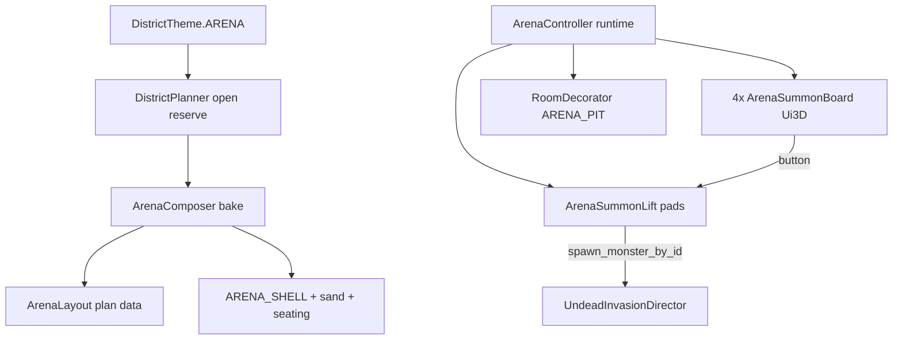

# Arena district

## Goals (locked)
- Full outer-ring district (Castle pattern): edge road stubs; special reserve fills almost the whole tile
- Outer mass ≈ rounded rect; inner pit = hard rectangle
- New indestructible `ARENA_SHELL` for pit walls, floor under sand, and summon shafts
- Four identical inward-facing Ui3D summon boards (static icons), one per pit side — full **CreatureCatalog** spawnables (not KayKit-only)
- Summon spectacle: lit elevator rises from under the pit and delivers the monster
- Spectators on seating tiers
- Pit clear/reshuffle: wipe props + despawn arena-tagged monsters + redecorate (`RoomDecorator` purpose)
- No special combat rules; natural AI if the player jumps in

## Architecture

## 1. Theme / planner / land use
Mirror Castle/Fractal wiring:
- [`scripts/city/district_theme.gd`](scripts/city/district_theme.gd): `ARENA := 10`, `COUNT := 11`, aliases (`arena`, `colosseum`), outer-ring pick pools, palette/blurb
- [`scripts/city/land_use.gd`](scripts/city/land_use.gd): `ARENA` tag (next free id after `FRACTAL`)
- [`scripts/city/district_planner.gd`](scripts/city/district_planner.gd): `large_arena` + `_build_arena_layout()` via `_fill_open_reserve`
- [`scripts/city/district_generator.gd`](scripts/city/district_generator.gd): ground paint, decorate path, spawn find (gate / balcony ring, not pit center)

## 2. Material: `ARENA_SHELL`
- [`scripts/city/voxel_material.gd`](scripts/city/voxel_material.gd) + [`native/city_voxel/src/materials.rs`](native/city_voxel/src/materials.rs): new id with careful `COUNT` bump (stay ≤ 256 nav table)
- `is_destructible` → false (same dig/blast class as BEDROCK)
- Surface in [`scripts/city/voxel_surface_spec.gd`](scripts/city/voxel_surface_spec.gd): sandstone / packed-arena look distinct from BEDROCK
- Library model: solid cube with collision
- Rebuild native DLL after id change

## 3. Bake: `ArenaComposer` + `ArenaLayout`
New scripts patterned on Castle:
- Plan: outer rounded-rect footprint (stepped/chamfered corners), inner rect pit, seating band, 4 gate tunnels, 4 board mounts, N summon lift pads in the pit (start with 4, one near each side)
- Paint: `ARENA_SHELL` for pit walls, undercroft slab, lift shafts; sand/dirt surface on pit floor; seating masonry + spectator props; approach from road stubs
- Far-sparse: shell silhouette only
- Expose layout on generator like `get_castle_layout()`

Pit volume recorded as a `RoomVolume` (or equivalent) for decorate/wipe.

## 4. Pit decorate / wipe
- [`scripts/city/room_decorator.gd`](scripts/city/room_decorator.gd): `Purpose.ARENA_PIT` — cover props (pillars, crates, low walls) that leave walk lanes; props-only for v1 (no heightfield sets yet)
- Runtime wipe button (shared Clear on all four boards):
  1. Despawn units tagged arena-owned
  2. Clear pit air band / props (keep `ARENA_SHELL` + sand slab)
  3. Redecorate with new seed
  4. Dirty/rebake nav for the pit AABB

## 5. Summon UI (four boards)
- New `ArenaSummonBoard` extends [`scripts/city/ui_3d.gd`](scripts/city/ui_3d.gd)
- Populate from `MonsterSummonPanel.summonable_ids()` / `CreatureCatalog` spawnables
- Static icon per id: prefer existing [`tools/monstershots/`](tools/monstershots/) if usable; else flat colored tile + label for v1, with a hook for atlas icons later
- Four instances, one per pit face, yaw facing inward; identical button grid + shared Clear control
- Press → request summon on nearest free lift (or free pad round-robin)

## 6. Summon elevator spectacle
- Dedicated `ArenaSummonLift` (do **not** reuse city `ElevatorShaft` cabin UX)
- Undercroft shaft lined with `ARENA_SHELL`; platform rises from below sand to flush
- Sequence: light cue → hatch/open → rise (monster via `spawn_monster_by_id` at pad, physics off until arrived) → release AI → lights down
- Tag spawned units as arena-owned for wipe
- Busy pad rejects or queues briefly; no special combat rules after release

Wire spawn through existing [`scripts/city/undead_invasion_director.gd`](scripts/city/undead_invasion_director.gd) `spawn_monster_by_id` so the full catalogue works.

## 7. Runtime hookup
- District instance / city root: when an Arena district loads, spawn `ArenaController` that owns boards + lifts + wipe
- Units despawned on district unload / wipe
- Hop / `--spawn-theme=arena` support like other special themes

## 8. Tests + shots
- `tools/test_arena_district.tscn`: bake asserts shell present, pit rect, non-destructible walls, layout has 4 board mounts + lifts; optional decorate count
- `tools/shot_arena_district.tscn` for aerial + pit + board views
- README blurb under district themes
- Extend material table tests if `COUNT` / native mirror changes

## Suggested build order
1. Theme + planner + `ARENA_SHELL` material
2. Composer shell (outer round / inner rect / seating / gates) — visually massive empty pit
3. Four boards + catalogue buttons + spawn at pit (no lift yet)
4. Summon lifts + lights
5. `ARENA_PIT` decorate + wipe (+ despawn)
6. Spectators polish + tests/shots

## Out of scope (v1)
- Animated button portraits
- Named floor “sets” / heightfield hazards
- Mob-vs-mob game modes, scoring, gates that lock the player in
- Subdividing the district into a smaller secondary arena
