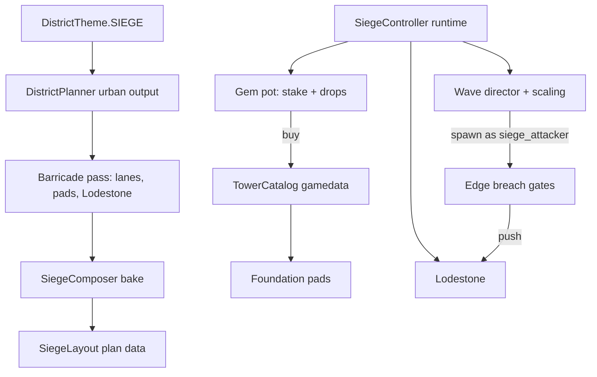

# Siege district

Tower defense in an ordinary city block. The tile bakes as a normal urban district; a
barricade pass walls off a quarter of it, drops a Lodestone in the grand plaza, and
stamps foundation pads. The player starts the siege, buys voxel towers with gems, and
holds as long as they can against a horde that never stops getting stronger.

## Goals (locked)

- **Reuses the urban planner.** Not a bespoke landmark like Castle/Arena. Streets are
  the lanes, the grand plaza is the objective, buildings are cover and elevation.
- **Gems are the build currency.** Tower costs are authored gem recipes, same shape as
  ability unlock costs. Gem *tier* determines the tower, not just the price — this is
  what finally gives the six gems distinct character.
- **Towers are voxel constructions**, not monsters. No creature meshes. They may
  *behave* like monsters under the hood (see §4).
- **No refunds.** Gems committed are gone. Skin in the game.
- **The run is a pot.** The player stakes gems to start, drops feed the pot, towers are
  bought from it, and it is banked on withdrawal or lost with the Lodestone. See §2.
- **Aggro is earned, not given.** Nothing acquires a tower or the player as prey. The
  horde's only standing goal is the Lodestone; anything that shoots gets retaliated
  against by the thing it shot. Because towers commit to a single target, only a few
  attackers are ever engaged and the rest walk past — which is where leak pressure comes
  from. See §6.
- **Endless.** No wave count, no clear condition. A wave counter drives HP and damage
  multipliers on every attacker. The run ends when the Lodestone falls or the player
  withdraws.
- **Later waves pay better for free** — kill drops already scale off max HP.
- **One attacker faction** (`siege_attacker`) so the horde does not fight itself.
- **Repair is an energy channel**, competing with the player's offensive abilities for
  the same pool.
- **No terrain reshaping as a defense.** There is no construction system and no real
  digging; voxels can be shot at an energy cost. The player cannot wall off lanes or
  break line of sight, so the generator owns the fight geometry.

## Architecture



## Implementation status

**Built — the tile exists and bakes.** `powershell -File tools\run_test.ps1 test_siege_district`

- `DistrictTheme.SIEGE` (id 13), palette, blurb, `%s Bulwark` naming, aliases, ring 2+ pools.
  Deliberately **not** in `is_special_id`: siege keeps roads, lots, signposts and its teleport
  chamber, because the streets are the lanes the horde walks.
- `DistrictPlanner.siege_quarter` — an 8 × 8 cell (~112 m) square centred on the grand plaza,
  chosen *after* the whole urban pass so the siege reads the finished grid instead of steering it.
  Cells keep their ordinary tags; the siege is an overlay, not a reserve.
- `SiegeLayout` — quarter rect, deck Y, Lodestone, gates with inward normals, pads with a
  `PadKind` of `STREET` / `ROOF_JUMP` / `ROOF_HIGH`, plus world-space accessors.
- `SiegeComposer` — the only *additive* composer. It runs last in `decorate_open_spaces`, after
  roads, plazas and facades are standing, and only ever writes solid voxels (never AIR), which is
  why the far pass can skip it without leaving holes to upgrade over. It paints the Lodestone,
  the barricade ring, and the pads.
- `DistrictGenerator` wiring: `get_siege_layout()`, and the quarter added to `open_space_bounds`
  tall enough for roof pads.
- `gamedata.json` `district_gems.theme_totals.siege` + `GameData.THEME_NAME_TO_ID`.

On the seed-42 tile: 3 gates, 15 pads (12 street, 2 jump-reachable roofs, 1 cloudstone-only roof),
a 224-probe perimeter 95% sealed, bake ~540 ms.

Two decisions worth remembering:

- **The Lodestone is `GLASS_LIT`, not a `GEM_*` material.** Gem voxels are collectible, so a
  gem Lodestone would let the player mine the objective they are defending. The test asserts no
  `GEM_*` inside its footprint.
- **No new voxel material was added.** A new id means rebuilding the native DLL, and nothing here
  needed one yet. A dedicated barricade/pad material is polish, not a blocker.

**Built — factions + controller skeleton.** `powershell -File tools\run_test.ps1 test_siege_faction`

- `MonsterFaction.SIEGE_ATTACKER` / `SIEGE_DEFENDER`, with `is_hostile` (damage) split from
  `can_acquire` (fresh prey). Defenders are never fresh prey; forced retaliation still works.
  `SPECTATOR` / Zoo cloak rules are untouched.
- `UndeadUnit.set_faction`, `set_push_aim`, `scale_for_wave`. Goal provider walks `push_aim`
  (the Lodestone) when nothing living is acquirable.
- `SiegeController`: stake → pot → intermission → waves (spawn at gates, faction override,
  HP/damage growth) → Lodestone contact DPS → withdraw banks the pot / loss burns it.
  Kill hauls during a run redirect into the pot via `CityRoot.grant_monster_kill_haul`.
- `gamedata.json` `siege` section + `GameData.siege_*`. Wired from `DistrictInstance`.

**Built — Lodestone interact + pot HUD.**

- `SiegeLodestonePanel` (Ui3D at the crystal): +/- stake per gem, START when ≥ min stake,
  WITHDRAW between waves. Click-aim like the Zoo cloak post.
- `SiegeHud` (CityRoot CanvasLayer): wave, pot total, Lodestone %, intermission clock while
  a run is live.

**Built — towers on pads.** `powershell -File tools\run_test.ps1 test_siege_towers`

- `siege_towers` catalogue in gamedata (one recipe per gem, mixed costs) + `siege/*` combat
  rows (`speed_mult` 0, `siege_defender`) with voxel stamps (no creature meshes).
- `SiegePadPanel` on each empty pad during a run; spend from pot → stamp → meshless
  `UndeadUnit.setup_siege_tower`. Tower kills credit the pot; player fire does not hurt
  own towers. Immobile commitment release on lost LOS.

**Not built yet** — energy-channel repair, streaming pin, amber slow, diamond beam.

## 1. Layout

A district is 392×280 m, which is far too large for a readable defense — the Arena fits
a whole colosseum into roughly 50×50 m. The siege ground should be a **walled quarter of
a few blocks (~120×120 m proposal)** inside an otherwise normal tile, so the player
walks through ordinary city to reach it.

The barricade pass exists to turn a four-way-open street grid into **two or three real
approaches**: rubble, wrecked Quaternius cars, shuttered facades, collapsed spans. Every
other street entering the quarter gets sealed.

- **Objective: the Lodestone.** A massive raw gem in the grand plaza (urban tiles
  already stamp one). Has its own HP pool; that pool is the run timer. Repairable by the
  player's channel. Its fall ends the run.
- **Breach gates.** 2–3 edge openings picked from the district seed. Attackers spawn
  outside and push inward.
- **Foundation pads.** Generator-placed, at street level and on rooftops. Pads rather
  than free placement because they are legible to the player, let the composer guarantee
  sane firing angles, cannot be used to block navigation, and are far less work. Pad
  count and distribution are the district's main difficulty dial.

### Pad access and elevation

Elevation is a real trade-off — a rooftop tower gets range and safety from melee, a street
tower gets coverage and eats the wave. The rule is that **the generator guarantees
reachability**; a pad the player cannot get to is a balance hole, and with no refunds it
is also a way to waste real gems.

- The player jumps 10 m, roughly three storeys, so low roofs are free.
- The barricade pass should stamp the access as part of the rubble it is already placing —
  collapsed walls, scaffolding, fire escapes — so baseline roof pads are jumpable without
  any item.
- **Cloudstones are an optimisation, never a requirement.** Premium high pads with the
  best sightlines can be seeded out of jump reach near tall buildings, so a player who
  came prepared gets a better position. Same instinct as gems: reward what you brought
  with you.
- Ranged repair (§5) means elevated towers stay serviceable from ground level, so access
  is a one-time placement concern rather than a per-wave one.
- Attackers must be able to answer rooftop towers — this is what ranged `wave_caster` rows
  are for — and the retaliation decay in §6 stops melee attackers stalling under a roof
  they cannot reach.

## 2. Economy: the pot

The run is a push-your-luck pot, not a purchase.

1. **Stake.** The player seeds the pot from their own inventory to start the siege. A
   minimum entry stake is mandatory (this also closes the "bring nothing, solo early
   waves, bank free gems" exploit).
2. **Drops.** Kills pay into the pot, not into the inventory. Uses the existing
   `floor(max_hp / 40)` score partitioned into tiers, so wave scaling raises income
   automatically. Drops never touch the player's 25 slots during a run.
3. **Spend.** Towers are bought from the pot. Rebuilding from rubble costs full price.
4. **Exit.** Withdraw between waves and bank the entire pot into the inventory, or lose
   the Lodestone and lose the pot, stake included.

This is what makes an endless mode end on a win instead of always ending on a loss, and
it makes "one more wave" the central decision of the district.

**Faucet control.** Unbounded waves plus HP-scaled drops is an unbounded gem faucet, and
gem scarcity is what currently holds the whole progression economy together. The run is
self-limiting in principle — multipliers grow without bound while tower DPS is fixed, so
every run ends — but whether *net* gems per run stay sane needs simulation, not
intuition. See §7.

## 3. Waves and scaling

A single `wave` counter drives multipliers applied on top of each attacker's resolved
combat stats:

- `hp_mult *= 1 + HP_K * (wave - 1)`
- `damage_mult *= 1 + DMG_K * (wave - 1)`, with `DMG_K < HP_K` so runs end by attrition
  rather than by one-shots

Linear to start; a slow exponential term after some wave guarantees termination in a
reasonable session length. All constants authored in `gamedata.json`.

**Count cannot be the scaler.** The Zoo caps a district at 34 live units. Wave size
grows to that ceiling and then stops, which is precisely why stat multipliers have to
carry the curve.

**Composition** comes from the `crowd_roles` already authored on monster rows. With the
aggro model in §6 doing the work, roles are flavour and pacing rather than a requirement —
every attacker pushes the Lodestone by default:

- **Melee bulk** — `wave_hunter` rows, the mass that has to be stopped before the plaza.
- **Ranged** — `wave_caster` rows, dangerous because they can answer rooftop towers.
- **Boss** — periodic `wave_boss` rows, on some interval.

Between waves there is a short **intermission** for building and repair, skippable early
for a bonus so a confident player can control pace.

## 4. Towers

A tower is a **voxel stamp plus a combat row**. `MonsterCombat` drives targeting, range,
cooldowns, windups and attack VFX off resolved stats and does not care whether a
creature mesh is attached — so a tower is authored as a row with `speed_mult` 0,
`behaviour: guard`, `leash_m` 0 and an attack list. The visual is the stamp, the body is
a static collider. This inherits the authored balance, the combat validator and the duel
simulator for free, with no monster ever appearing on screen.

Two places the reuse breaks and must be handled explicitly:

- `CreatureHealth` derives HP from collider height and creature family, which is
  meaningless for a building. Towers need authored HP.
- **Faction.** Towers are unacquirable rather than `human` — see §6. Player fire must not
  damage own towers.

**Damage visuals:** abstract HP driving three authored stamp variants — intact, cracked,
rubble. Not voxel-accurate chewing, which makes "destroyed" hard to define and turns
repair into a fiddly refill.

### Roster sketch — one per gem, gem picks the tower

| Gem | Tower | Attack kind | Role |
|-----|-------|-------------|------|
| Quartz | Splinter Post | `projectile_rapid` | Cheap chip damage, the backbone |
| Amber | Resin Vat | `area` + slow | Crowd control — **needs a new slow mechanic** |
| Topaz | Arc Pylon | `projectile_single` | Mid-tier single target |
| Sapphire | Frost Lance | `projectile_single`, long range | Reaches pushers before they arrive |
| Emerald | Bloom Mortar | `area_blast` | Punishes clumped waves |
| Diamond | Prism Spire | beam, high DPS | Boss answer; you can afford one |

Five of the six map onto attack kinds that already exist. Only the slow needs new
mechanics. Costs should be *mixed* recipes (a topaz tower costs topaz **and** quartz) so
common gems never become worthless.

Possible seventh: a support pylon that buffs neighbours, reusing the existing `auras`
system rather than a new one.

## 5. Repair

An energy channel with **range and line of sight** — 15–20 m proposal. Hold on a damaged
tower to restore it; the same channel works on the Lodestone.

Ranged matters more than it sounds. Placement happens once, but repair happens every wave
at the worst possible moment, so if a rooftop tower could only be repaired by standing on
that roof, roof access would become a tax on the core loop rather than a choice. A ranged
channel lets the player service elevated towers from the street. See §1 on pad access.

Energy is already the pool every offensive ability draws from, so repair is a live trade
— every second spent keeping the amber tower alive is damage not dealt. That tension is
the reason to use energy and not a new resource.

Channelled rather than instant: interruptible, dramatic, and it forces the player to
stand in the dangerous place on purpose. Repair restores HP only; a tower reduced to
rubble is gone and must be rebought at full price from the pot.

Open: whether this is a zone-only verb or a global "Mend" ability in the tray that
happens to matter most here. Global is cleaner for the schematic/unlock system.

## 6. Faction and the aggro model

### The horde

New `siege_attacker` faction for every attacker, so the wave does not civil-war itself in
the street. Faction is currently authored per monster row, so it becomes a **spawn-time
override** — an ephemeral property of the spawned body, not a change to gamedata.

Naming note: existing factions are flavour (`undead`, `human`) while `siege_attacker` is
mechanical. Fine for clarity; a flavour name would age better if these ever appear
outside the siege.

### Towers and the player are unacquirable

Rather than authoring pusher/breaker/hunter roles to stop the horde stalling on the first
tower it meets, make towers and the player **impossible to acquire as prey**. The horde
then has exactly one standing goal — the Lodestone — and walks at it. Aggro is created
only by shooting: the thing you hit turns on you.

This is emergent and free. The player controls aggro by controlling fire, area towers
self-balance because they pull whole packs at once, and a hold-fire toggle becomes a real
ambush tactic rather than a feature we have to invent.

**What already works.** `UndeadUnit.apply_damage_scaled` calls
`_promote_attacker_after_hit`, which sets `_forced_attacker` on the goal provider, and
`_forced_prey_aim()` is consulted *before* normal prey search — so a hit overrides table
weights and LOS acquisition entirely. Retaliation is wired, and it does not consult
`is_hostile`, so an otherwise-unacquirable entity can still become forced prey.

**What blocks it.** `MonsterFaction.is_hostile` is symmetric for `SPECTATOR`:

```gdscript
if a == Id.SPECTATOR or b == Id.SPECTATOR:
    return false
```

The authored intent is explicit — *"a cloaked player cannot start a fight either."* So
reusing `SPECTATOR` for towers means **towers cannot fire**. Overloading it would also
silently change what the Zoo's cloak means.

**The fix: split the question the function conflates.** `is_hostile` currently answers
both "may A acquire B as prey?" and "may A damage B?" with one predicate. The siege needs
those to differ:

| | acquirable as prey | may attack | may be damaged |
|---|---|---|---|
| Tower | no | yes | yes, once it has made itself a target |
| Player (in siege) | no | yes | yes, same rule |
| Attacker | yes | yes | yes |

Cleanest route is a new faction id with an explicitly asymmetric rule, leaving `SPECTATOR`
and the Zoo untouched.

### Ignoring what cannot be answered

Nav can settle this directly. `NavService.reachable(profile_id, from, to)` is a component
query on the coarse node/portal graph rather than a search, and its polarity is the useful
one: *"a false here is final, a true is a candidate."* It is also per-profile, so it
accounts for a wide body not fitting a corridor a skeleton walks.

`NavAgent` also already has the behaviour on its failure ladder — rung 2 `PATH_PARTIAL`
("unreachable for this profile; walk to the best reachable span, then re-evaluate") and
rung 5 `GOAL_UNREACHABLE` ("nothing routes there; abandon the goal and ask the provider for
another") — and `_clear_pursuit()` nulls `_forced_attacker`. So the rooftop stall may
already break itself.

**Verify before building.** The subtle failure is a loop: the ladder abandons the goal, the
provider re-serves the same forced attacker, repeat. A test should confirm which way it
actually goes.

Two refinements if reachability is used as the promotion gate:

- Reachability is the wrong question for ranged bodies, which need to get within
  `preferred_range_m` with line of sight rather than reach the target at all.
  `has_voxel_line_of_sight` covers that half.
- A `true` can be technically correct and absurd — a roof reachable only through a
  building interior and stairwell is reachable, but a mob taking a sixty-second detour to
  punch a tower reads as broken. Gate on path cost or distance as well as the boolean.

### Target commitment gives the leak gradient for free

No retaliation decay is needed. Towers commit to one target, so only a handful of the
horde is ever engaged. `UndeadGoalProvider._nearest_living_prey` states the authority
order — forced attacker, then committed target, then a fresh pick — and `_acquire_prey`
runs only when neither of the first two holds. `_committed_aim()` drops a commitment on
exactly two conditions: the target is dead or gone, or it has put the leash between them.
Losing line of sight does **not** break it; that becomes Investigate.

So at any instant there is at most one aggro'd attacker per tower. Eight towers against a
34-unit wave means eight peel off and twenty-six walk past to the Lodestone:

> **leak rate = wave size − tower kill throughput**

That self-regulates against the wave curve with no extra machinery. Rising mob HP means
each tower is occupied longer per kill, throughput drops, more streams past, and Lodestone
HP becomes a live readout of how the run is going. The difficulty gradient is a consequence
of the scaling constants rather than a separate system.

### Consequences of commitment

- **Placement is the only targeting control.** `_acquire_prey` picks nearest-with-LOS and
  the comment is explicit — *"No weights — the only questions are faction and distance."*
  There is no first/last/strongest priority to expose, no focus fire, and no switching to
  finish a wounded target. A tower's position, its `aggro_range_m`, and what its voxel line
  of sight covers are the whole tactical vocabulary. This is a deliberate design property,
  not a gap to fill: it is what makes the urban layout the game.
- **Area towers break commitment usefully.** An `area_blast` tower commits to one target but
  splashes everything nearby, and everything splashed retaliates — so it aggros more than it
  shoots. A real mechanical drawback for AoE instead of an invented balance number.
- **Leash is the tower's give-up range.** `_inside_leash` measures from the body's own
  position, so for a stationary tower authored `leash_m` is simply its disengage distance.

### For an immobile body, pursuit means release

A mobile hunter resolves "I cannot hit this" by walking. A tower cannot, so every condition
that sends a mobile body into pursuit must instead make a tower drop its target: out of
attack range, line of sight broken, or past the leash. One rule, three cases. This is about
immobility only — never about how much health the target has left.

Mechanically this is a small change to the existing path. `_committed_aim()` already clears
on leash and already returns `INF` when LOS is gone — the difference is that for a zero-speed
body that `INF` must call `_clear_target()` rather than becoming Investigate.

**`NavService.reachable()` is the wrong signal for this.** It is uniformly false for a tower,
including for a mob at point-blank range that the tower is shooting perfectly well, because it
answers *"can I walk there"* and a tower's entire job is hitting things it cannot walk to. Used
as the release trigger it would drop every target every tick. Range and LOS are what
discriminate.

### There is no "cannot kill" case

Damage never stalls. Armor is a divisor rather than a subtraction
(`raw := amount * scale / armor`), `_health` only ever decreases, and neither `UndeadUnit` nor
`CreatureHealth` has any heal or regeneration path. Every tower kills every target eventually;
a cheap tower against a late-wave body is slow, not helpless.

What actually happens is a race — the attacker damages the tower while the tower damages it —
and when wave damage scaling tips that race the tower dies. That is ordinary obsolescence, and
the answers already exist: repair it, or reinvest in a heavier gem.

**Damage is banked.** With no regeneration, a tower that releases a half-killed target and
reacquires it later loses only a windup; the health already removed stays removed. Target
switching is therefore cheap, and no partial kill is ever wasted.

### Attention sinks are a feature

A high-HP attacker occupies one tower's commitment for a long time while fodder walks past it.
That makes brutes function as attention sinks and gives high-HP wave composition a tactical
role beyond toughness. Counters are all player-controlled: spread coverage so no one tower is
the whole answer, area towers that splash leakers while committed elsewhere, and repair to hold
the occupied tower through it.

### Do not switch on "something closer"

Switching must trigger only on *cannot hit*. Attacks carry windups plus a 2 s global cooldown,
so churn among several mobs at the edge of range would burn cooldowns without ever firing.
Commitment is the protection against that and should stay sticky until the target is genuinely
unhittable.

### Reachability is still needed

A mob that retaliates against an unreachable rooftop tower stays forced onto it — the leash
is measured from its own position and it is standing directly underneath. So the promotion
gate above still applies.

Balance consequence: if melee attackers ignore what they cannot reach, rooftop towers are
melee-immune, so the **ranged share of each wave is the real balance knob for roof pads**.

## 7. Balance tooling

This repo already tunes combat with Python mirrors (`simulate_monster_duels.py`,
`validate_combat_tables.py`, golden fixtures). An endless scaler with an economy
attached should get the same treatment: `tools/simulate_siege_waves.py`, answering

- How many waves does a given gem stake survive?
- Net gems per run at each stake size — is the district a sink, neutral, or a faucet?
- Does any tower composition dominate?
- **Kill throughput per tower per wave**, since leak rate is wave size minus throughput
  (§6). This is the number that decides pacing, and it is a straight time-to-kill
  calculation against the wave's scaled HP — exactly what the existing duel simulator
  already does for 1v1.

## 8. Runtime notes

- **Player-initiated**, like the Arena rather than the Zoo. The player scouts, sees the
  pads, then commits at the Lodestone. No siege runs unattended.
- **Streaming pin.** Towers are ephemeral voxels; an active run must pin its tile
  against unload and far-LOD downgrade or the defense evaporates.
- **Difficulty by ring** comes free — theme pools are already ring-distance based, so a
  siege far from origin can start at a higher effective wave.
- **Information before commitment.** Because nothing is refundable, the player needs a
  wave preview and readable pad layout before spending.

## Open questions

- Exact siege-ground footprint, pad count, and number of breach gates.
- Do low-tier towers stay worth building in late waves as chip damage and attention sinks, or
  do they need a scaling hook of their own? Answerable in the sim (§7).
- Does the nav ladder already break the unreachable-attacker loop on its own, or does
  `promote_attacker` need an explicit reachability gate? Needs a test.
- With the player unacquirable and no mob-side decay, is repair ever actually risky? The
  tension may now have to come from attackers the player has personally shot, or from area
  attacks aimed at towers catching them.
- Do tower kills credit the pot? They must, but kill haul currently runs through a
  player-kill path (`kill_from_player` / `is_player_vs_creature`), so this needs wiring.
- Should towers have a hold-fire toggle? Falls out of the aggro model for nearly free and
  makes ambush builds possible, but it is another control to explain.
- Does losing persist? The per-coord save row has `explored` and `owed` fields; a sacked
  district could stay sacked, or spill raiders into neighbouring tiles until retaken.
  Nice, but scope.
- Should the player be able to convert attackers to their side (`orb_convert` exists)?
- Does the Lodestone regenerate between waves at all, or only via player repair?

## Out of scope (v1)

- World gem pickups collected under fire (drops go straight to the pot).
- Tower upgrade trees — one tier per gem, rebuild to change.
- Selling or relocating towers.
- Terrain-based defense of any kind.
- Multi-tile sieges or horde spillover into neighbouring districts.
