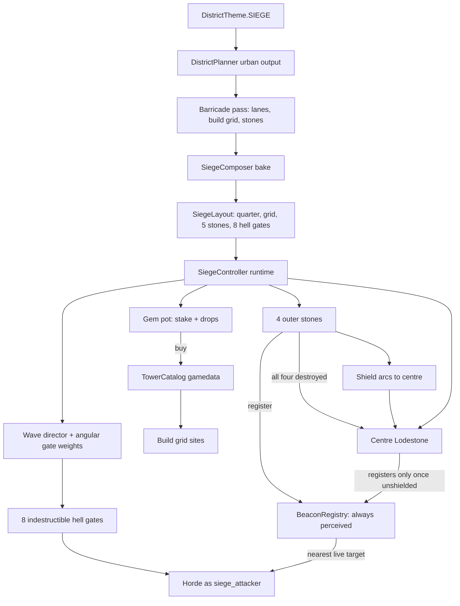

# Siege district

Tower defense in an ordinary city block. The tile bakes as a normal urban district; a
barricade pass walls off a quarter of it, drops a Lodestone in the grand plaza, and
stamps a build grid. The player starts the siege, buys voxel towers with gems, and
holds as long as they can against a horde that never stops getting stronger.

The fight is not one objective in a plaza. Four **outer stones**, roughly halfway out
toward the tile corners, shield the centre Lodestone: it cannot be hurt while any of
them stands. They are far enough apart that the player cannot hold all four, which is the
point — every wave is a bet on which one to defend, or a decision to spend the horde's
travel time turning the quarter into a fortress instead. See §9.

## Goals (locked)

- **Reuses the urban planner.** Not a bespoke landmark like Castle/Arena. Streets are
  the lanes, the grand plaza holds the centre objective, buildings are cover and elevation.
  The run reaches well beyond the walled quarter — see §1.
- **Gems are the build currency.** Tower costs are authored gem recipes, same shape as
  ability unlock costs. Gem *tier* determines the tower, not just the price — this is
  what finally gives the six gems distinct character.
- **Towers are voxel constructions**, not monsters. No creature meshes. They may
  *behave* like monsters under the hood (see §4).
- **No refunds.** Gems committed are gone. Skin in the game.
- **The run is a pot.** The player stakes gems to start, drops feed the pot, towers are
  bought from it, and it is banked on withdrawal or lost with the Lodestone. See §2.
- **Aggro is earned, not given.** Nothing acquires a tower or the player as prey. The
  horde's only standing goal is the nearest live **stone**; anything that shoots gets
  retaliated against by the thing it shot. Because towers commit to a single target, only
  a few attackers are ever engaged and the rest walk past — which is where leak pressure
  comes from. See §6.
- **Five objectives, one of them shielded.** Four outer stones plus the centre Lodestone.
  The centre takes no damage and is not even a valid target while any outer stone lives.
  Outer stones are a **forever loss** — no rebuild, only repair while they still stand.
- **Stones are beacons.** A stone is perceived by every monster on the tile at any range,
  through walls, ignoring `aggro_range_m` and leash. That is a reusable property of the
  stone rather than siege-specific wiring, and it is what lets the horde route itself with
  no per-body assignment. See §9.
- **The horde comes from real gates.** Eight indestructible hell gates, not spawns from
  thin air, sited outboard of the outer stones so the army works inward.
- **Every wave has a bearing.** Per-wave gate weights are deliberately skewed around one
  assault axis, so a wave is an army from one direction with harassment elsewhere — and
  the gates telegraph it before it lands. See §9.
- **Endless.** No wave count, no clear condition. A wave counter drives HP and damage
  multipliers on every attacker. The run ends when the centre Lodestone falls or the
  player withdraws.
- **Later waves pay better for free** — kill drops already scale off max HP.
- **One attacker faction** (`siege_attacker`) so the horde does not fight itself.
- **Repair is an energy channel**, competing with the player's offensive abilities for
  the same pool.
- **No terrain reshaping as a defense.** There is no construction system and no real
  digging; voxels can be shot at an energy cost. The player cannot wall off lanes or
  break line of sight, so the generator owns the fight geometry.

  This survived a serious challenge. Buildable **barriers** — cheap voxel walls the horde
  has to path around — were the first answer to "the whole zone is unused", and they would
  work: `CityBrush.voxels_changed` feeds `NavDirtyTracker`, which rebuilds sectors under a
  2 ms/frame budget, so a stamped wall really does reroute the horde. They were rejected
  because they need two systems that do not exist (a path-existence check per build so the
  last lane cannot be sealed, and "attack the thing blocking me" behaviour for when it is),
  and because the five-stone spread in §9 buys the same "use the whole map" outcome out of
  machinery that is already working. Barriers remain a viable later pass, not a v1.

## Architecture



## Implementation status

**Built — the tile exists and bakes.** `powershell -File tools\run_test.ps1 test_siege_district`

- `DistrictTheme.SIEGE` (id 13), palette, blurb, `%s Bulwark` naming, aliases, ring 2+ pools.
  Deliberately **not** in `is_special_id`: siege keeps roads, lots, signposts and its teleport
  chamber, because the streets are the lanes the horde walks.
- `DistrictPlanner.siege_quarter` — an 8 × 8 cell (~112 m) square centred on the grand plaza,
  chosen *after* the whole urban pass so the siege reads the finished grid instead of steering it.
  Cells keep their ordinary tags; the siege is an overlay, not a reserve.
- `SiegeLayout` — quarter rect, deck Y, Lodestone, gates with inward normals, pads with a
  `PadKind` of `STREET` / `ROOF_JUMP` / `ROOF_HIGH`, plus world-space accessors.
- `SiegeComposer` — the only *additive* composer. It runs last in `decorate_open_spaces`, after
  roads, plazas and facades are standing, and only ever writes solid voxels (never AIR), which is
  why the far pass can skip it without leaving holes to upgrade over. It paints the Lodestone,
  the barricade ring, and the pads.
- `DistrictGenerator` wiring: `get_siege_layout()`, and the quarter added to `open_space_bounds`
  tall enough for roof pads.
- `gamedata.json` `district_gems.theme_totals.siege` + `GameData.THEME_NAME_TO_ID`.

On the seed-42 tile: 3 gates, 15 pads (12 street, 2 jump-reachable roofs, 1 cloudstone-only roof),
a 224-probe perimeter 95% sealed, bake ~540 ms.

Two decisions worth remembering:

- **The Lodestone is `GLASS_LIT`, not a `GEM_*` material.** Gem voxels are collectible, so a
  gem Lodestone would let the player mine the objective they are defending. The test asserts no
  `GEM_*` inside its footprint.
- **No new voxel material was added.** A new id means rebuilding the native DLL, and nothing here
  needed one yet. A dedicated barricade/pad material is polish, not a blocker.

**Built — factions + controller skeleton.** `powershell -File tools\run_test.ps1 test_siege_faction`

- `MonsterFaction.SIEGE_ATTACKER` / `SIEGE_DEFENDER`, with `is_hostile` (damage) split from
  `can_acquire` (fresh prey). Defenders are never fresh prey; forced retaliation still works.
  `SPECTATOR` / Zoo cloak rules are untouched.
- `UndeadUnit.set_faction`, `set_push_aim`, `scale_for_wave`. Goal provider walks `push_aim`
  (the Lodestone) when nothing living is acquirable.
- `SiegeController`: stake → pot → deployment window → waves on a clock (spawn at gates,
  faction override, HP/damage growth) → Lodestone contact DPS → withdraw banks the pot / loss
  burns it.
  Kill hauls during a run redirect into the pot via `CityRoot.grant_monster_kill_haul`.
- `gamedata.json` `siege` section + `GameData.siege_*`. Wired from `DistrictInstance`.

**Built — Lodestone interact + pot HUD.**

- `SiegeLodestonePanel` (Ui3D at the crystal): +/- stake per gem, START when ≥ min stake,
  WITHDRAW for the whole run. Click-aim like the Zoo cloak post.
- `SiegeHud` (CityRoot CanvasLayer): wave, pot total, Lodestone %, and the clock to the next
  wave while a run is live.

**Built — towers on pads.** `powershell -File tools\run_test.ps1 test_siege_towers`

- `siege_towers` catalogue in gamedata (one recipe per gem) + `siege/*` combat rows
  (`speed_mult` 0, `siege_defender`) with voxel stamps (no creature meshes).
- Costs are a flat **one gem** per tower for now. The mixed recipes in §4 remain the design
  intent; the first pass at real prices was far too expensive to playtest with.
- `SiegePadPanel` is a lay-flat "+" plate on the pad surface. Pressing it opens
  `SiegeBuildPicker`, a mouse-adjacent modal on `UiLayers.MODAL_SIEGE_BUILD` listing only
  recipes the pot can afford. Spend from pot → stamp → meshless
  `UndeadUnit.setup_siege_tower`. Tower kills credit the pot; player fire does not hurt
  own towers. Immobile commitment release on lost LOS.
- `MonsterRoster.MAX_ALIVE_UNITS` raised 40 → 80, and hitting it is now a **soft hold**:
  the spawn returns null quietly and the queued body stays queued. A siege plus its towers
  was overrunning the old cap, and the queue used to drop the body and flood the error
  overlay.

**Built — dense build sites.** `powershell -File tools\run_test.ps1 test_siege_district`

- The caps and the cell stride are gone. The composer sweeps the whole quarter at
  `SITE_SCAN_STEP` 4 voxels and keeps every position that passes, thinned only by the 5 m
  `PAD_SPACING`. Seed 42 yields **272 sites (259 street, 13 roof)** against the old 18, and
  the bake cost 542 ms — the spacing test is a spatial hash, not a linear scan.
- Spacing is a **same-surface** rule (`SAME_LEVEL_VOX`). Applying it across levels deleted the
  roof tier, because a sidewalk runs along every facade and so blocked every roof *edge* —
  which is the part of a roof worth building on.
- Roof candidates are gated on the land-use tag being a lot, which replaced a 60-voxel column
  walk per candidate. The obvious voxel probe does not work: buildings are hollow, so an
  interior column is air well above the deck, and probing it cut the roof tier to one site.
- Foundations are painted flush. The corner studs are gone; at this density they were a field
  of ankle-high metal bumps across every sidewalk, and the "+" plate is the marker now.

**Built — plates at every site.** Hundreds of `SiegePadPanel`s, affordable because of three
things: `Ui3D.set_view_distance_m` (engine-side `visibility_range_end`, 30 m, hard cutoff so no
fade drags them into the transparent pass), `cast_shadow` off on every `Ui3D` mesh, and an
opaque plate face. Plates are built `PLATES_PER_FRAME` at a time rather than all at once.
Colliders are handed out separately by proximity (`PLATE_TOUCH_M` 5 m) — view culling leaves
bodies live, and `CityWalker._try_world_interact` rays 100 m and swallows the shot on any panel
it hits, so a field of live plates would eat every shot aimed low.

**Built — the wave clock.** No all-clear state: `Phase.DEPLOY` (one window before the first
wave) then `Phase.RUNNING` forever, with a wave every `wave_period_sec`. The batch drips across
`wave_drip_fraction` of the period. Batch size is the shortfall against `alive_target()`, so
leftovers chewing a far stone thin the next wave instead of hitting a wall. Withdrawal is legal
for the whole run — the gate is the walk back to the console. `MAX_ALIVE_UNITS` now bounds
*walkers* only, with `MAX_ALIVE_TOTAL` 220 covering immobile towers, because a plated quarter
was otherwise able to starve the horde attacking it.

**Not built yet** — the five-stone rework in §9 (beacon registry, outer stones, hell gates,
gate weight tables, shield arcs), energy-channel repair, streaming pin, amber slow,
diamond beam.

## 1. Layout

A district is 392×280 m. The **fortress** is still a walled quarter of a few blocks
(8 × 8 planner cells, ~112 m) centred on the grand plaza, because a readable last stand
needs to be small — the Arena fits a whole colosseum into roughly 50×50 m. But the **run**
now spans most of the tile: the outer stones sit roughly halfway out toward the corners and
the hell gates sit outboard of those, so the ordinary city between them is the approach the
horde walks and the ground the player chooses whether to contest. That was the fix for the
original failure, where every fight resolved inside a 5 m ring at the crystal and the rest
of the district was scenery.

The barricade pass exists to turn a four-way-open street grid into **two or three real
approaches**: rubble, wrecked Quaternius cars, shuttered facades, collapsed spans. Every
other street entering the quarter gets sealed.

- **Objectives: five stones.** The centre Lodestone in the grand plaza (urban tiles already
  stamp one), plus four outer stones. Each has its own HP pool and its own vulnerability
  radius; the centre's pool is the run timer, the outer four are the clock that buys the
  player setup time. All five are repairable by the player's channel. See §9.
- **Breaches.** 2–3 gaps in the barricade ring, picked from the district seed. These are no
  longer spawn points — they are where the converging horde funnels in once the outer stones
  are gone, which is what makes the ring matter at the endgame.
- **Hell gates.** Eight indestructible portals out in the city, sited outboard of the outer
  stones. This is where bodies actually enter the world. See §9.
- **Build grid.** A site anywhere there is room for a tower that will not interfere, at a
  **5 m minimum spacing**. The policy is deliberately permissive: the default answer to
  "can a tower stand here" is yes. Sites are generator-placed rather than free-placed for
  exactly one reason — so placement cannot be used to block things — and every exclusion
  rule has to justify itself against that one reason. See "Build sites" below.
  Distribution relative to the five stones — not raw count — is the district's difficulty dial.

### Build sites: permissive by default

**5 m minimum spacing between sites** is already the constant in the composer.
`PAD_SPACING` is 10 voxels at 0.5 m per voxel, and the footprint is 5 × 5 voxels
(`PAD_HALF` 2, so 2.5 m), which leaves 2.5 m of walkable gap between neighbouring towers.
So the density work is not a spacing change at all — it is removing the things that throttle
the search:

- `PAD_TARGET` 12 and `ROOF_PAD_TARGET` 6 were hard caps. Gone.
- `PAD_CELL_STRIDE` 2 meant only every second planner cell was looked at. Gone.
- `_find_pad_ground_in_cell` took **at most one** jittered spot per cell out of six random
  attempts. Now a sweep at `SITE_SCAN_STEP` 4 voxels keeping every position that passes.
- The scan is still bounded to `quarter_cells`, the barricaded block. It has to cover the ground
  around each outer stone as well, or "go defend the north stone" means arriving there with
  nowhere to build. **Outstanding**, and it belongs with the outer stones themselves.

A position is refused only when one of these applies, and nothing else:

- The 5 × 5 footprint is not flat, level, clear-skied ground of a buildable surface material.
- It is on the carriageway.
- It is inside the quarter's edge margin, the Lodestone square, an outer stone's clear ring,
  or a hell gate mouth's clearance (§9).
- It is within 5 m of a site already taken **on the same surface**. Across levels the rule does
  not apply: a rooftop tower and the sidewalk under it are not one firing position, and enforcing
  the gap between them deletes the roof *edges*, since a sidewalk runs along every facade.

The **carriageway exclusion is the load-bearing rule**, and it is what makes the permissive
default safe. Roads are never buildable and the road graph reaches the whole tile, so no
amount of building can disconnect anything. Sidewalks, alleys and plaza throats can be walled
off freely and it costs the horde nothing structurally, because the lane beside them is
always still open.

Mazing is also less of a threat than it first looks. A tower is a destructible defender unit,
so a line of towers is a wall that shoots and gets shot, paid for in gems — that is a
legitimate use of the mechanic, not an exploit, and it gets the barrier fantasy from §"No
terrain reshaping" without any of the machinery that idea needed. The only cases actually
worth excluding are the degenerate ones: sealing a spawn mouth, or ringing a stone in
geometry the horde routes around instead of fighting.

Measured yield on the seed-42 quarter: **272 sites — 259 street, 9 jump-reachable roofs, 4
cloudstone-only roofs**, against 18 before, for 542 ms of bake. The spacing test is a spatial hash
over `PAD_SPACING`-edged bins; a linear scan was fine at eighteen sites and is not at hundreds.

### Plates everywhere, culled at 30 m

Every site keeps its lay-flat "+" plate, gone past 30 m. Rendering-side this is free and was
already in the codebase: `GeometryInstance3D.visibility_range_end`, which `monster_health_bar.gd`
uses for exactly this "gone at range" job. No polling, no pooling, no custom LOD.

The cost per plate is 8 nodes, of which 4 are `MeshInstance3D` (surface, button, and two glyph
bars), plus one `StaticBody3D`. Roughly 2200 nodes and 1100 mesh instances for a 272-site
quarter, with only the 30 m worth ever drawn. Four things make that affordable, all of them now
in `Ui3D` so every panel benefits:

- **Shadows off** on every mesh, unconditionally. They default to casting, and a UI slab throwing
  a shadow onto the world is a bug at any count; at a thousand quads the atlas costs more than
  the drawing.
- **A hard cutoff, not a fade.** `VISIBILITY_RANGE_FADE_SELF` dissolves via material alpha, which
  would drag every culled plate back into the transparent pass — the exact cost the cutoff exists
  to avoid. A 1 m plate winking in at 30 m is a speck.
- **An opaque face.** The plate used to be `surface_color.a` 0.85; hundreds of sorted translucent
  quads lying on the ground is the worst overdraw case there is.
- **Built a few per frame** (`PLATES_PER_FRAME`), because standing 2200 nodes up in the frame the
  run starts is a visible hitch, and nobody can press a plate across the quarter in that second.

If the node count does turn out to hurt, the fallback is a single `MultiMesh` of "+" quads with
the distance cutoff in the shader — one draw call for the whole field — plus real `SiegePadPanel`
nodes pooled only for the sites within arm's reach. Same look, almost no per-site cost, more code.

**The collider was the real trap, and visibility range does not solve it.**
`visibility_range_end` hides a mesh but leaves its `StaticBody3D` live, and
`CityWalker._try_world_interact` raycasts `laser_range_m` — **100 m** — swallowing the shot
whenever it hits a `Ui3D` panel *before* firing a bolt. Hundreds of flat plates inside that radius
would eat any shot aimed low. So colliders are gated separately and far tighter than the visuals:
plates are born deaf and `SiegeController._tick_plate_proximity` hands a collider to whatever is
within `PLATE_TOUCH_M`. `Ui3D.set_hit_enabled` still ties `visible` and `collision_layer` together
for ordinary panels; `set_collision_enabled` is the decoupled half.

### Pad access and elevation

Elevation is a real trade-off — a rooftop tower gets range and safety from melee, a street
tower gets coverage and eats the wave. The rule is that **the generator guarantees
reachability**; a pad the player cannot get to is a balance hole, and with no refunds it
is also a way to waste real gems.

- The player jumps 10 m, roughly three storeys, so low roofs are free.
- The barricade pass should stamp the access as part of the rubble it is already placing —
  collapsed walls, scaffolding, fire escapes — so baseline roof pads are jumpable without
  any item.
- **Cloudstones are an optimisation, never a requirement.** Premium high pads with the
  best sightlines can be seeded out of jump reach near tall buildings, so a player who
  came prepared gets a better position. Same instinct as gems: reward what you brought
  with you.
- Ranged repair (§5) means elevated towers stay serviceable from ground level, so access
  is a one-time placement concern rather than a per-wave one.
- Attackers must be able to answer rooftop towers — this is what ranged `wave_caster` rows
  are for — and the retaliation decay in §6 stops melee attackers stalling under a roof
  they cannot reach.

## 2. Economy: the pot

The run is a push-your-luck pot, not a purchase.

1. **Stake.** The player seeds the pot from their own inventory to start the siege. A
   minimum entry stake is mandatory (this also closes the "bring nothing, solo early
   waves, bank free gems" exploit).
2. **Drops.** Kills pay into the pot, not into the inventory. Uses the existing
   `floor(max_hp / 40)` score partitioned into tiers, so wave scaling raises income
   automatically. Drops never touch the player's 25 slots during a run.
3. **Spend.** Towers are bought from the pot. Rebuilding from rubble costs full price.
4. **Exit.** Withdraw at the centre Lodestone and bank the entire pot into the inventory, or
   lose the Lodestone and lose the pot, stake included. There is no safe phase to bank in
   (§10), so cashing out means physically getting back to the crystal.

This is what makes an endless mode end on a win instead of always ending on a loss, and
it makes "one more wave" the central decision of the district.

**Faucet control.** Unbounded waves plus HP-scaled drops is an unbounded gem faucet, and
gem scarcity is what currently holds the whole progression economy together. The run is
self-limiting in principle — multipliers grow without bound while tower DPS is fixed, so
every run ends — but whether *net* gems per run stay sane needs simulation, not
intuition. See §7.

## 3. Waves and scaling

A single `wave` counter drives multipliers applied on top of each attacker's resolved
combat stats:

- `hp_mult *= 1 + HP_K * (wave - 1)`
- `damage_mult *= 1 + DMG_K * (wave - 1)`, with `DMG_K < HP_K` so runs end by attrition
  rather than by one-shots

Linear to start; a slow exponential term after some wave guarantees termination in a
reasonable session length. All constants authored in `gamedata.json`.

**Count cannot be the scaler.** The Zoo caps a district at 34 live units. Wave size
grows to that ceiling and then stops, which is precisely why stat multipliers have to
carry the curve.

**Composition** comes from the `crowd_roles` already authored on monster rows. With the
aggro model in §6 doing the work, roles are flavour and pacing rather than a requirement —
every attacker walks at the nearest live stone by default:

- **Melee bulk** — `wave_hunter` rows, the mass that has to be stopped before it reaches
  whichever stone this wave is aimed at.
- **Ranged** — `wave_caster` rows, dangerous because they can answer rooftop towers.
- **Boss** — periodic `wave_boss` rows, on some interval.

**Waves are a clock, not a room to clear.** A wave lands every `wave_period_sec` (~120 s)
whether or not the last one is dead, and there is no "all clear" state — see §10. Leftovers
are not cleaned up; they keep chewing whatever stone they reached. Building, repair and
reading the gates all happen live, under pressure.

**Where a wave comes from is also a wave property.** Per-wave gate weights are skewed around
a rolled bearing, so direction is part of the curve alongside HP and damage. See §9.

## 4. Towers

A tower is a **voxel stamp plus a combat row**. `MonsterCombat` drives targeting, range,
cooldowns, windups and attack VFX off resolved stats and does not care whether a
creature mesh is attached — so a tower is authored as a row with `speed_mult` 0,
`behaviour: guard`, `leash_m` 0 and an attack list. The visual is the stamp, the body is
a static collider. This inherits the authored balance, the combat validator and the duel
simulator for free, with no monster ever appearing on screen.

Two places the reuse breaks and must be handled explicitly:

- `CreatureHealth` derives HP from collider height and creature family, which is
  meaningless for a building. Towers need authored HP.
- **Faction.** Towers are unacquirable rather than `human` — see §6. Player fire must not
  damage own towers.

**Damage visuals:** abstract HP driving three authored stamp variants — intact, cracked,
rubble. Not voxel-accurate chewing, which makes "destroyed" hard to define and turns
repair into a fiddly refill.

### Roster sketch — one per gem, gem picks the tower

| Gem | Tower | Attack kind | Role |
|-----|-------|-------------|------|
| Quartz | Splinter Post | `projectile_rapid` | Cheap chip damage, the backbone |
| Amber | Resin Vat | `area` + slow | Crowd control — **needs a new slow mechanic** |
| Topaz | Arc Pylon | `projectile_single` | Mid-tier single target |
| Sapphire | Frost Lance | `projectile_single`, long range | Reaches pushers before they arrive |
| Emerald | Bloom Mortar | `area_blast` | Punishes clumped waves |
| Diamond | Prism Spire | beam, high DPS | Boss answer; you can afford one |

Five of the six map onto attack kinds that already exist. Only the slow needs new
mechanics. Costs should be *mixed* recipes (a topaz tower costs topaz **and** quartz) so
common gems never become worthless.

Possible seventh: a support pylon that buffs neighbours, reusing the existing `auras`
system rather than a new one.

## 5. Repair

An energy channel with **range and line of sight** — 15–20 m proposal. Hold on a damaged
tower to restore it; the same channel works on **any stone**, the four outer ones included.

Repairing an outer stone means physically going there, which is the whole point: it is the
verb that makes "go defend the north stone this wave" a real option rather than a slogan.
The channel's short range is what stops it being a remote-control button on four objectives
spread across a tile.

Ranged matters more than it sounds. Placement happens once, but repair happens every wave
at the worst possible moment, so if a rooftop tower could only be repaired by standing on
that roof, roof access would become a tax on the core loop rather than a choice. A ranged
channel lets the player service elevated towers from the street. See §1 on pad access.

Energy is already the pool every offensive ability draws from, so repair is a live trade
— every second spent keeping the amber tower alive is damage not dealt. That tension is
the reason to use energy and not a new resource.

Channelled rather than instant: interruptible, dramatic, and it forces the player to
stand in the dangerous place on purpose. Repair restores HP only; a tower reduced to
rubble is gone and must be rebought at full price from the pot. A **destroyed outer stone
cannot be brought back at any price** — repair is only ever a way to keep one alive.

Open: whether this is a zone-only verb or a global "Mend" ability in the tray that
happens to matter most here. Global is cleaner for the schematic/unlock system.

## 6. Faction and the aggro model

### The horde

New `siege_attacker` faction for every attacker, so the wave does not civil-war itself in
the street. Faction is currently authored per monster row, so it becomes a **spawn-time
override** — an ephemeral property of the spawned body, not a change to gamedata.

Naming note: existing factions are flavour (`undead`, `human`) while `siege_attacker` is
mechanical. Fine for clarity; a flavour name would age better if these ever appear
outside the siege.

### Towers and the player are unacquirable

Rather than authoring pusher/breaker/hunter roles to stop the horde stalling on the first
tower it meets, make towers and the player **impossible to acquire as prey**. The horde
then has exactly one standing goal — the Lodestone — and walks at it. Aggro is created
only by shooting: the thing you hit turns on you.

This is emergent and free. The player controls aggro by controlling fire, area towers
self-balance because they pull whole packs at once, and a hold-fire toggle becomes a real
ambush tactic rather than a feature we have to invent.

**What already works.** `UndeadUnit.apply_damage_scaled` calls
`_promote_attacker_after_hit`, which sets `_forced_attacker` on the goal provider, and
`_forced_prey_aim()` is consulted *before* normal prey search — so a hit overrides table
weights and LOS acquisition entirely. Retaliation is wired, and it does not consult
`is_hostile`, so an otherwise-unacquirable entity can still become forced prey.

**What blocks it.** `MonsterFaction.is_hostile` is symmetric for `SPECTATOR`:

```gdscript
if a == Id.SPECTATOR or b == Id.SPECTATOR:
    return false
```

The authored intent is explicit — *"a cloaked player cannot start a fight either."* So
reusing `SPECTATOR` for towers means **towers cannot fire**. Overloading it would also
silently change what the Zoo's cloak means.

**The fix: split the question the function conflates.** `is_hostile` currently answers
both "may A acquire B as prey?" and "may A damage B?" with one predicate. The siege needs
those to differ:

| | acquirable as prey | may attack | may be damaged |
|---|---|---|---|
| Tower | no | yes | yes, once it has made itself a target |
| Player (in siege) | no | yes | yes, same rule |
| Attacker | yes | yes | yes |

Cleanest route is a new faction id with an explicitly asymmetric rule, leaving `SPECTATOR`
and the Zoo untouched.

### Ignoring what cannot be answered

Nav can settle this directly. `NavService.reachable(profile_id, from, to)` is a component
query on the coarse node/portal graph rather than a search, and its polarity is the useful
one: *"a false here is final, a true is a candidate."* It is also per-profile, so it
accounts for a wide body not fitting a corridor a skeleton walks.

`NavAgent` also already has the behaviour on its failure ladder — rung 2 `PATH_PARTIAL`
("unreachable for this profile; walk to the best reachable span, then re-evaluate") and
rung 5 `GOAL_UNREACHABLE` ("nothing routes there; abandon the goal and ask the provider for
another") — and `_clear_pursuit()` nulls `_forced_attacker`. So the rooftop stall may
already break itself.

**Verify before building.** The subtle failure is a loop: the ladder abandons the goal, the
provider re-serves the same forced attacker, repeat. A test should confirm which way it
actually goes.

Two refinements if reachability is used as the promotion gate:

- Reachability is the wrong question for ranged bodies, which need to get within
  `preferred_range_m` with line of sight rather than reach the target at all.
  `has_voxel_line_of_sight` covers that half.
- A `true` can be technically correct and absurd — a roof reachable only through a
  building interior and stairwell is reachable, but a mob taking a sixty-second detour to
  punch a tower reads as broken. Gate on path cost or distance as well as the boolean.

### Target commitment gives the leak gradient for free

No retaliation decay is needed. Towers commit to one target, so only a handful of the
horde is ever engaged. `UndeadGoalProvider._nearest_living_prey` states the authority
order — forced attacker, then committed target, then a fresh pick — and `_acquire_prey`
runs only when neither of the first two holds. `_committed_aim()` drops a commitment on
exactly two conditions: the target is dead or gone, or it has put the leash between them.
Losing line of sight does **not** break it; that becomes Investigate.

So at any instant there is at most one aggro'd attacker per tower. Eight towers against a
34-unit wave means eight peel off and twenty-six walk past to the Lodestone:

> **leak rate = wave size − tower kill throughput**

That self-regulates against the wave curve with no extra machinery. Rising mob HP means
each tower is occupied longer per kill, throughput drops, more streams past, and Lodestone
HP becomes a live readout of how the run is going. The difficulty gradient is a consequence
of the scaling constants rather than a separate system.

### Consequences of commitment

- **Placement is the only targeting control.** `_acquire_prey` picks nearest-with-LOS and
  the comment is explicit — *"No weights — the only questions are faction and distance."*
  There is no first/last/strongest priority to expose, no focus fire, and no switching to
  finish a wounded target. A tower's position, its `aggro_range_m`, and what its voxel line
  of sight covers are the whole tactical vocabulary. This is a deliberate design property,
  not a gap to fill: it is what makes the urban layout the game.
- **Area towers break commitment usefully.** An `area_blast` tower commits to one target but
  splashes everything nearby, and everything splashed retaliates — so it aggros more than it
  shoots. A real mechanical drawback for AoE instead of an invented balance number.
- **Leash is the tower's give-up range.** `_inside_leash` measures from the body's own
  position, so for a stationary tower authored `leash_m` is simply its disengage distance.

### For an immobile body, pursuit means release

A mobile hunter resolves "I cannot hit this" by walking. A tower cannot, so every condition
that sends a mobile body into pursuit must instead make a tower drop its target: out of
attack range, line of sight broken, or past the leash. One rule, three cases. This is about
immobility only — never about how much health the target has left.

Mechanically this is a small change to the existing path. `_committed_aim()` already clears
on leash and already returns `INF` when LOS is gone — the difference is that for a zero-speed
body that `INF` must call `_clear_target()` rather than becoming Investigate.

**`NavService.reachable()` is the wrong signal for this.** It is uniformly false for a tower,
including for a mob at point-blank range that the tower is shooting perfectly well, because it
answers *"can I walk there"* and a tower's entire job is hitting things it cannot walk to. Used
as the release trigger it would drop every target every tick. Range and LOS are what
discriminate.

### There is no "cannot kill" case

Damage never stalls. Armor is a divisor rather than a subtraction
(`raw := amount * scale / armor`), `_health` only ever decreases, and neither `UndeadUnit` nor
`CreatureHealth` has any heal or regeneration path. Every tower kills every target eventually;
a cheap tower against a late-wave body is slow, not helpless.

What actually happens is a race — the attacker damages the tower while the tower damages it —
and when wave damage scaling tips that race the tower dies. That is ordinary obsolescence, and
the answers already exist: repair it, or reinvest in a heavier gem.

**Damage is banked.** With no regeneration, a tower that releases a half-killed target and
reacquires it later loses only a windup; the health already removed stays removed. Target
switching is therefore cheap, and no partial kill is ever wasted.

### Attention sinks are a feature

A high-HP attacker occupies one tower's commitment for a long time while fodder walks past it.
That makes brutes function as attention sinks and gives high-HP wave composition a tactical
role beyond toughness. Counters are all player-controlled: spread coverage so no one tower is
the whole answer, area towers that splash leakers while committed elsewhere, and repair to hold
the occupied tower through it.

### Do not switch on "something closer"

Switching must trigger only on *cannot hit*. Attacks carry windups plus a 2 s global cooldown,
so churn among several mobs at the edge of range would burn cooldowns without ever firing.
Commitment is the protection against that and should stay sticky until the target is genuinely
unhittable.

### Reachability is still needed

A mob that retaliates against an unreachable rooftop tower stays forced onto it — the leash
is measured from its own position and it is standing directly underneath. So the promotion
gate above still applies.

Balance consequence: if melee attackers ignore what they cannot reach, rooftop towers are
melee-immune, so the **ranged share of each wave is the real balance knob for roof pads**.

## 7. Balance tooling

This repo already tunes combat with Python mirrors (`simulate_monster_duels.py`,
`validate_combat_tables.py`, golden fixtures). An endless scaler with an economy
attached should get the same treatment: `tools/simulate_siege_waves.py`, answering

- How many waves does a given gem stake survive?
- Net gems per run at each stake size — is the district a sink, neutral, or a faucet?
- Does any tower composition dominate?
- **Kill throughput per tower per wave**, since leak rate is wave size minus throughput
  (§6). This is the number that decides pacing, and it is a straight time-to-kill
  calculation against the wave's scaled HP — exactly what the existing duel simulator
  already does for 1v1.

## 8. Runtime notes

- **Player-initiated**, like the Arena rather than the Zoo. The player scouts, sees the
  build grid and the arcs, then commits at the centre Lodestone. No siege runs unattended.
- **Streaming pin.** Towers are ephemeral voxels; an active run must pin its tile
  against unload and far-LOD downgrade or the defense evaporates. Narrower than it first
  looked: `DistrictInstance._pin_data_only` already keeps the whole tile's voxel data
  resident while the instance lives, so distant stones and towers survive being unwatched.
  What is missing is preventing the **instance itself** from being streamed out while a run
  is live — the run now spans most of the tile, and the player can walk far enough to trip
  it.
- **Difficulty by ring** comes free — theme pools are already ring-distance based, so a
  siege far from origin can start at a higher effective wave.
- **Information before commitment.** Because nothing is refundable, the player needs a
  wave preview and readable pad layout before spending.

## 9. Five stones, beacons and hell gates

This section is the rework. Everything above it describes a single objective in a plaza fed
by spawns at the barricade; playtesting that build produced three complaints, and they all
have the same root cause.

1. **~20 seconds of setup.** A gate mouth is ~56 m from the crystal and `intermission_sec`
   is 8, so wave one lands about twenty seconds in.
2. **Far too few build sites.** `PAD_TARGET` 12 street plus `ROOF_PAD_TARGET` 6 roof, at a
   10-voxel minimum spacing on a stride-2 cell scan: eighteen positions in 112 m of city.
3. **The zone is unused.** Attackers walk straight at the crystal and
   `lodestone_vulnerable_radius_m` is 5, so the entire fight happens in one 5 m ring.
   A tower 40 m out engages a couple of bodies and the rest stream past it.

### The five stones

Four outer stones, placed roughly **halfway out from the tile centre toward the corners** —
on the order of ±(98, 70) m, so ~120 m from the middle and well outside the barricaded
quarter. The centre Lodestone is **invulnerable, and not a valid target at all**, while any
outer stone still stands.

- Outer stones are chosen by the composer near those four target points, searching outward
  for open, flat, buildable ground with clear sky — same style of site search the build grid
  uses. They are `GLASS_LIT` like the centre, never a `GEM_*` material.
- Losing one is **permanent**. No rebuild at any price; repair only holds a living stone.
- The centre's beacon must be **deregistered** while shielded, not merely invulnerable.
  Otherwise the horde still computes it as nearest and piles up chewing something that
  cannot be hurt. It registers the instant the fourth stone falls, which is the moment the
  run turns into the last stand the quarter was built for.
- Damage reuses the machinery that already works: a stone is not a combat entity, it is a
  position plus an HP pool plus a radius, and `_tick_lodestone`-style contact DPS counts
  attackers inside it. Five stones is a list where there is currently one scalar.
- **The player cannot hold all four, deliberately.** Fixing that would be missing the point:
  the choice each wave is which stone to contest, and the legitimate alternative is to
  concede all four and spend their chewing time fortifying the centre.

### Beacons: an always-perceived target property

The horde is **not** assigned to stones. Every monster perceives every stone at all times
and picks for itself, which is both simpler and better behaviour than a director handing out
targets.

- A `BeaconRegistry` holds entries of world position, vulnerability radius, owner faction and
  a targetable flag. The goal system consults it directly, bypassing `aggro_range_m`, line of
  sight and leash entirely — the stone is transplanted into awareness regardless of distance.
- This replaces the current per-unit `set_push_aim`, and it is deliberately **generic**: any
  future thing that should pull a horde across a map registers a beacon instead of growing
  its own aggro wiring.
- Selection is **nearest by straight line** with hysteresis, so a body standing between two
  stones does not flip-flop, plus a forced re-evaluation when a stone dies. Straight-line
  rather than path length because ranking by real path cost for 34 bodies every re-evaluation
  is not worth what it buys.
- **Owner faction gates who cares.** Outer stones stand in ordinary city, so without a faction
  filter ambient wildlife would chew them down before wave one under the district alive cap.
  First pass: siege attackers only. Opening it to the whole city is a one-line change and may
  well be a good mode later.
- Emergent property worth keeping: when a stone dies its attackers retarget to the nearest one
  still standing, so the horde **concentrates as the player loses ground** and the last outer
  stone is a bloodbath. The difficulty ramp writes itself.

### Hell gates

Eight of them, indestructible, sited outboard of the outer stones between each stone and the
tile edge — a ring on the order of ±(150, 110) m from centre, which fits the tile's 196 × 140 m
half-extents with margin. Bodies walk **out of a structure**, never out of thin air.

- Built from the existing zoo containment kit: `ZOO_FENCE_FRAME`, `ZOO_FENCE_LINE`,
  `ZOO_FENCE_GLASS`. All three are `Hardness.NEVER` already, and the red line is authored
  specifically to read at range. No new voxel material, so no native rebuild.
- The mouth is filled with **`LOS_VEIL`** — invisible, walk-through, blocks combat line of
  sight and projectiles. Monsters leave freely and the player **cannot shoot into a gate**.
  That kills spawn-camping mechanically rather than relying on the player being spread thin.
- The mouth must clear the largest body in the roster, so size it generously rather than to
  the average.
- **Nothing buildable within a few metres of a mouth.** The frame is indestructible; a walled
  mouth would trap that lane's horde in a box forever. The build grid inherits the clearance
  rule the pads already have against gate centres.
- Gates are baked geometry, so they exist between runs and advertise the district. They only
  produce bodies while a run is live.

### Per-wave gate weights

Each wave rolls a **bearing**, and gate weights fall off with angular distance from it, over a
small floor everywhere. A wave is then an army from the north-east with harassment elsewhere,
rather than eight equal taps or two random dots.

- Because targeting is beacon-driven, a wave weighted north spawns bodies whose nearest stone
  *is* the northern one. The skew therefore **is** the answer to "which stone is threatened
  this wave", which is what converts "you cannot defend all four" from a limitation into the
  actual game.
- The support trickle means committing everything to one front still costs slow chew elsewhere.
  A read is a bet, not a free answer.
- **The tell is the gate's emissive intensity**, driven by the weight the gate carries for the
  *next* wave. The red line already reads at range, so a gate about to vomit an army simply
  burns brighter. There is no intermission to read it in (§10), so it is a rolling forecast: the
  next bearing lights the moment the current batch finishes spawning, giving a lead time to be
  tuned against travel time. A HUD line as backup for when the player is indoors.
- The weight table **is** the ignition mechanism — a gate with zero weight this wave is a dark
  gate — so there is no separate progressive-opening system.
- The skew is the difficulty curve: early waves one clear axis and a low floor, later waves two
  heavy axes on opposite sides or a raised floor. Concentrated pressure becomes divided
  pressure as the player gets better at answering it.
- The same primary is forbidden two waves running, so one fortified corner cannot be the whole
  answer.
- Shape lives in `gamedata.json` (primary share, falloff, floor, the wave two-axis assaults
  start), and the roll derives from `district_seed ^ wave` so runs are reproducible and a test
  can assert the primary takes its share, no gate drops below the floor, and the axis moves.
- Later flourish, not v1: let the heavy axis bring the big bodies while support gates send fast
  harassers, so the main army *feels* like the main army rather than merely being larger.

### Shield arcs

A light arc from each living outer stone to the centre, dying when that stone dies.

- Purely informational — no mechanical effect on anything passing under one. Making arcs do
  something is a possible second pass once the five-stone loop feels right.
- They are not decoration, they are the **primary readout**. `DistrictInstance._pin_data_only`
  pins the tile as a data-only viewer: the whole tile's voxels stay resident so a stone 120 m
  away can be stamped, damaged and destroyed, but *meshes* only build near the player. The
  player therefore cannot see the outer fights at all. An arc winking out is the most
  informative thing on screen, and it is the pressure.
- Distant attackers are on the MID/FAR nav tiers, which follow spans without collision, so the
  horde walks those approaches fine with nobody watching.
- Crib the visual from `infection_sky_beam_vfx.gd` / `go_giant_beam.gd`. The apex wants to
  clear the skyline so an arc reads from inside the quarter.

### Naming cleanup

`SiegeLayout.gates` currently means "gap in the barricade where the horde spawns". Those two
jobs now split, so the field names should too: **`hell_gates`** for the spawn portals and
**`breaches`** for the barricade gaps. Nobody should have to guess which kind a `gate` is.

## 10. The wave clock and the soft horde target

The phase machine cannot survive §9, and not for taste reasons. A wave currently ends on
`_spawn_queue.is_empty() and _alive.is_empty()`, which quietly assumes the player personally
kills everything because everything funnelled into one plaza. With stones out on the tile,
bodies chewing an undefended stone are killed by nobody: `_alive` never empties, the run sits
in `WAVE` forever, and those survivors then hold the alive cap so the spawn hold stops queueing
— a deadlock where nothing spawns and there is nothing to fight.

**Waves become a timer.** One wave every `wave_period_sec` (120 s), unconditionally. Built.

- The `_alive.is_empty()` wave-end condition is deleted, not repaired. Nothing waits on the
  horde being dead, so nothing can deadlock on it.
- `Phase.INTERMISSION` collapses into a single **deployment window** before the first wave —
  the run is staked, the gates are dark, and that is the player's real setup time. After it
  there are no pauses.
- Leftovers are never cleaned up. A body that reached a stone keeps chewing it for the rest of
  the run, which is what makes an ignored flank cost something.
- `spawn_interval_sec` is now only a *floor* on the drip. The batch is stretched across
  `wave_drip_fraction` of the period, because a batch that drains in five seconds would leave
  115 s of quiet.
- The wave index keeps its old job as the scaling counter for HP, damage, composition and gate
  weights. Structure comes from escalation and boss beats, not from phases.
- Withdrawal can no longer mean "between waves". It becomes physical: reach the centre
  Lodestone and use it, which turns banking into a run across contested ground.
- The §3 skip-the-intermission bonus disappears with the intermission.

**The horde cap becomes a soft target.** Batch size stops being `base + growth` clamped by a
wall and becomes the difference between where the horde should be and where it is:
`batch = clamp(target_alive(wave) - alive_now, min_trickle, max_batch)`.

- This is what makes persistent leftovers affordable. Bodies stuck on a far stone count against
  the target, so the next wave is smaller rather than the spawner hitting a wall and erroring.
- It also gives the run a coherent trade: **ignoring the horde buys quiet and spends stone HP.**
  Leave forty bodies chewing the north stone and the next waves are thin — you are not being
  punished with more pressure, you are losing the stone instead.
- `MonsterRoster.MAX_ALIVE_UNITS` is demoted to a frame-rate safety net, and now bounds
  **walkers** only. Siege towers are immobile, meshless and nav-free, so they are gated instead on
  `MAX_ALIVE_TOTAL` (220). Counting them as walkers let a well-funded defence starve the horde it
  was built to fight, which a 272-site quarter makes reachable rather than theoretical.
- `alive_target_base` / `alive_target_growth` set the target per wave; `district_alive_cap` 34 is
  its ceiling, and `test_siege_faction` asserts that exact value, so retuning it touches that test.

## Open questions

- How much HP an outer stone carries relative to the centre, and whether four stones plus a
  much longer approach makes a run too long per wave. Wants the sim (§7).
- `wave_period_sec` 120, `deploy_sec` 45 and `wave_drip_fraction` 0.5 are first guesses. All want
  the sim (§7) and a playtest.
- `PLATE_TOUCH_M` 5 m: far enough to press a "+" comfortably, small enough not to eat shots. Needs
  a playtest — the failure mode is subtle in both directions.
- Whether 259 street sites reads as opportunity or as wallpaper. The plating is flush metal on
  every buildable surface now, which is a lot of industrial texture over a quarter that is
  supposed to still look like a city.
- Exact hell gate count. Eight is the proposal; the floor is "enough that camping one is
  obviously bad".
- Do low-tier towers stay worth building in late waves as chip damage and attention sinks, or
  do they need a scaling hook of their own? Answerable in the sim (§7).
- Does the nav ladder already break the unreachable-attacker loop on its own, or does
  `promote_attacker` need an explicit reachability gate? Needs a test.
- With the player unacquirable and no mob-side decay, is repair ever actually risky? The
  tension may now have to come from attackers the player has personally shot, or from area
  attacks aimed at towers catching them.
- Do tower kills credit the pot? They must, but kill haul currently runs through a
  player-kill path (`kill_from_player` / `is_player_vs_creature`), so this needs wiring.
- Should towers have a hold-fire toggle? Falls out of the aggro model for nearly free and
  makes ambush builds possible, but it is another control to explain.
- Does losing persist? The per-coord save row has `explored` and `owed` fields; a sacked
  district could stay sacked, or spill raiders into neighbouring tiles until retaken.
  Nice, but scope.
- Should the player be able to convert attackers to their side (`orb_convert` exists)?
- Does any stone regenerate on its own at all, or only via player repair? With no pauses (§10)
  a passive trickle is the only thing that would ever undo chip damage on a flank the player
  has abandoned.

## Out of scope (v1)

- World gem pickups collected under fire (drops go straight to the pot).
- Tower upgrade trees — one tier per gem, rebuild to change.
- Selling or relocating towers.
- Terrain-based defense of any kind, including the buildable barrier maze evaluated under
  Goals. Viable later, not v1.
- Rebuilding a destroyed outer stone, at any price.
- Arcs with a mechanical effect on attackers passing beneath them.
- Ambient city monsters joining the siege by seeing the beacons.
- Multi-tile sieges or horde spillover into neighbouring districts.
